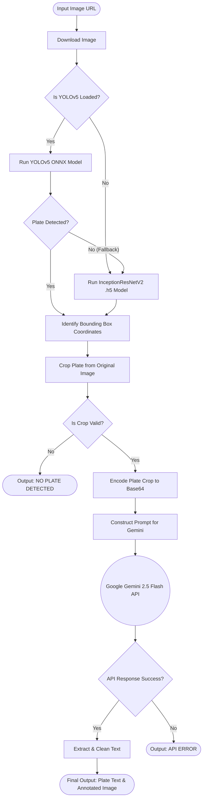

# Automatic License Plate Detection

#### RESULTS
<table><tr>
<td>  </td>
<td>  </td>
</tr></table>

#### DETECT LICENSE PLATES WITH THE YOLO ALGORITHM

In Today’s Day and Age Security has become one of the biggest concerns for any organization, and automation of such security is essential. However, many of the current solutions are still not robust in real-world situations, commonly depending on many constraints. In the following project, we will understand how to recognize License number plates using the Python programming language. We will utilize OpenCV for this project in order to identify the license number plates and the python pytesseract for the characters and digits extraction from the plate. As well this project will presents a robust and efficient ALPR system based on the state-of-the-art YOLO object detector. We will Web App with a Python program that automatically recognizes the License Number Plate by the end of this journi. The results have shown that the trained neural network is able to perform with high accuracy of nearly 90-95 percent in recognizing license plates in low resolution images using this system.

#### ABOUT DATASET

This project dataset contains 453 files - images in JPEG format with bounding box annotations of the car license plates within the image. Annotations are provided in the PASCAL VOC format. Pascal VOC(Visual Object Classes) is a format to store annotations for localizer or Object Detection datasets and is used by different annotation editors and tools to annotate, modify and train Machine Learning models. In PASCAL VOC format, for each image there is a xml annotation file containing image details, bounding box details, classes, rotation and other data.

#### TABLE OF CONTENT

- LABELING, UNDERSTAND & COLLECT REQUIRED DATA
- DATA PROCESSING
- DEEP LEARNING FOR OBJECT DETECTION
- PIPELINE OBJECT DETECTION MODEL
- OPTICAL CHARACTER RECOGNITION - OCR
- NUMBER PLATE WEB APP
- RAEAL TIME NUMBER PLATE RECOGNITIONT WITH YOLO

#### CLOUD PIPELINE ARCHITECTURE (VLM OCR)

This project features a modern Kaggle and Cloud-ready inference pipeline that bypasses traditional, fragile OCR engines (like PyTesseract) in favor of Google's state-of-the-art **Gemini 2.5 Flash** Vision-Language Model.

1. **Object Detection (YOLOv5 & InceptionResNetV2)**: 
   - **Primary Model**: YOLOv5 is used as the primary detector because it is highly robust to different image scales and angles.
   - **Fallback Model**: Safely falls back to the original `InceptionResNetV2` model if YOLO fails.
2. **Text Extraction (Google Gemini 2.5 Flash)**:
   - Evaluates the raw license plate image via Google's REST API, perfectly extracting text, spacing, and avoiding character confusion (e.g. `6` vs `G`) common in standard OCR techniques.
